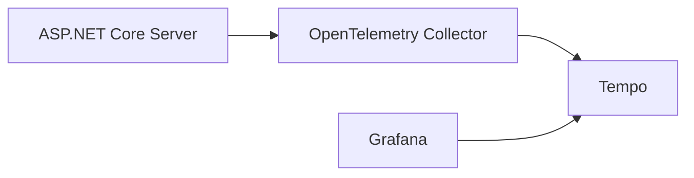

# AspNetCore.SignalR.OpenTelemetry

[](https://www.nuget.org/packages/AspNetCore.SignalR.OpenTelemetry)
[](https://github.com/nenoNaninu/AspNetCore.SignalR.OpenTelemetry/actions/workflows/build-and-test.yaml)

This is an [Instrumentation Library](https://github.com/open-telemetry/opentelemetry-specification/blob/main/specification/glossary.md#instrumentation-library), which instruments ASP.NET Core SignalR and collect traces about SignalR hub method invocations. 

## Table of Contents

- [Install](#install)
- [Usage](#usage)
  - [Exception Handling](#exception-handling)
  - [Filter](#filter)
- [Example](#example)
- [Related Work](#related-work)

## Install

NuGet: [AspNetCore.SignalR.OpenTelemetry](https://www.nuget.org/packages/AspNetCore.SignalR.OpenTelemetry/)

```
dotnet add package AspNetCore.SignalR.OpenTelemetry
```

## Usage

```cs
var builder = WebApplication.CreateBuilder(args);

builder.Services.AddSignalR()
    .AddHubInstrumentation(); // <- Add this!

builder.Services.AddOpenTelemetry()
    .ConfigureResource(builder =>
    {
        builder.AddService("AspNetCore.SignalR.OpenTelemetry.Example");
    })
    .WithTracing(providerBuilder =>
    {
        providerBuilder
            .AddAspNetCoreInstrumentation()
            .AddSignalRInstrumentation() // <- Add this!
            .AddOtlpExporter();
    });
```

### Exception Handling

By setting the `OnException` option, you can override the attributes that this library writes by default. 
For example, when an exception occurs inside your SignalR hub method, this library sets the `otel.status_code` attribute to `ERROR`. 
However, there are cases where you do not want a specific exception to be `ERROR`.
In that case, you can override the default attribute by setting it as follows.

```cs
builder.Services.AddSignalR()
    .AddHubInstrumentation(options =>
    {
        options.OnException = static (activity, exception) =>
        {
            if (exception is HubException)
            {
                activity.SetTag("otel.status_code", "OK");
            }
        };
    });
```

### Filter

If you want to capture traces of specific methods or don't want to capture traces of a specific method, use the `Filter` option.
`Filter` function that determines whether or not to collect telemetry on a per invocation basis.

```cs
builder.Services.AddSignalR()
    .AddHubInstrumentation(options =>
    {
        // same as LINQ's Where method
        options.Filter = context =>
        {
            return context.HubMethodName != "MethodNameOfNotCaptureTraces";
        };
    });
```


## Example

The example code architecture is as follows.



The example code can be quickly executed from Visual Studio.


It can also be quickly executed from the CLI.

```
$ docker compose build
$ docker compose up
```

- App Server: http://localhost:8080/signalr-dev/index.html
- Grafana: http://localhost:3000/explore

In Grafana, you can see the SignalR method call trace as follows.


## Related Work

- [nenoNaninu/TypedSignalR.Client](https://github.com/nenoNaninu/TypedSignalR.Client)
  - C# Source Generator to create strongly typed SignalR clients.
- [nenoNaninu/TypedSignalR.Client.TypeScript](https://github.com/nenoNaninu/TypedSignalR.Client.TypeScript)
  - TypeScript source generator to provide strongly typed SignalR clients by analyzing C# type definitions.
- [nenoNaninu/TypedSignalR.Client.DevTools](https://github.com/nenoNaninu/TypedSignalR.Client.DevTools)
  - SignalR development tools inspired by SwaggerUI.
