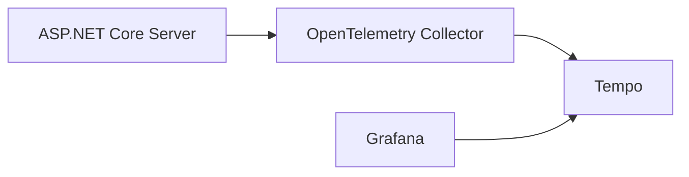

# AspNetCore.SignalR.OpenTelemetry

This is an [Instrumentation Library](https://github.com/open-telemetry/opentelemetry-specification/blob/main/specification/glossary.md#instrumentation-library), which instruments ASP.NET Core SignalR and collect metrics and traces about SignalR hub method invocations. 

## Table of Contents

- [Install](#install)
- [Usage](#usage)
- [Example](#example)

## Install

NuGet: [AspNetCore.SignalR.OpenTelemetry](https://www.nuget.org/packages/AspNetCore.SignalR.OpenTelemetry/)

```
dotnet add package AspNetCore.SignalR.OpenTelemetry
```

## Usage

```cs
var builder = WebApplication.CreateBuilder(args);

builder.Services.AddSignalR(options =>
{
    options.AddFilter<HubInstrumentationFilter>(); // <- Add this!
});

builder.Services.AddOpenTelemetry()
    .ConfigureResource(builder =>
    {
        builder.AddService("AspNetCore.SignalR.OpenTelemetry.Example");
    })
    .WithTracing(providerBuilder =>
    {
        providerBuilder
            .AddAspNetCoreInstrumentation()
            .AddSignalRInstrumentation() // <- Add this!
            .AddOtlpExporter();
    });
```

## Example

The example code architecture is as follows.



The example code can be quickly executed from Visual Studio.


It can also be quickly executed from the CLI.

```
$ docker compose build
$ docker compose up
```

- App Server: http://localhost:8080/signalr-dev/index.html
- Grafana: http://localhost:3000/explore

In Grafana, you can see the SignalR method call trace as follows.


